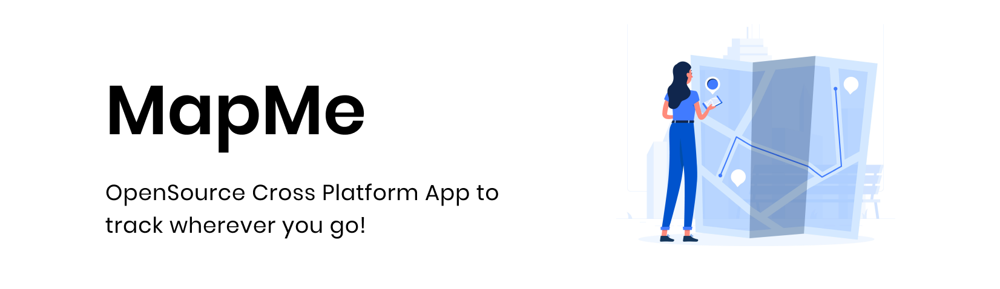

<p>
  <div align="center">
    
   </div>
 </p>
 
  # Disclaimer
 FYI, We aren’t facebook to collect your data! 😅
 
 # About
 Cross Platform app built using React Native and Async storage with the help of Google Map API.
 
 # What's in here?
 - React Native :atom:
 - Async Storage 🗄️
 - GoogleMaps API 🗺️
# How to Build the App 📱

## Fork the repo 🍴

## Clone the repo 🔻
```
git clone <url>
```
- example : `git clone https://github.com/swaaz/Mapme.git`

## Add API key before building 🔑
We can’t afford Google’s API. 😢
### Open [Google Developer Page](https://developers.google.com/maps/documentation/android-sdk/get-api-key)
copy the API key and paste it inside `~Mapme/app.json`
```
{
  "expo": {
   "name": "MapMe",
   "icon": "./assets/icons/logo.png",
   "version": "2.0.0",
   "slug": "MapMe",
   "ios": {
     "bundleIdentifier": "com.yourcompany.yourappname",
     "buildNumber": "1.0.0"
   },
   "android": {
     "package": "com.yourcompany.yourappname",
     "versionCode": 1,
        "config": {
          "googleMaps": {
              "apiKey": "" //Add the Google Map Android SDK API here
          }
      }
   }
  }
}
```
### Open [Weather API](https://openweathermap.org/api)
copy the API key and paste it inside `~Mapme/screens/HomeScreen.jsx` line number `97`
```
fetch(`https://api.openweathermap.org/data/2.5/weather?lat=${getCurrentLocation.latitude}&lon=${getCurrentLocation.longitude}&units=metric&appid=`) // Add the Weather API Key here
.then((response) => response.json())
.then((json) => setWeather({ temperature : json.main.temp, loaded : true}))
.catch((error) => console.error(error))
```
## Install Dependencies ⚛️
```
expo install
or 
npm install
```
## Now you're good to go! 🔥
```
expo build
```
### Resources 📚
- [Expo Documentation](https://docs.expo.io/)
- [React Native](https://reactnative.dev/)
- [Map View](https://docs.expo.io/versions/latest/sdk/map-view/)
- [Location API](https://docs.expo.io/versions/latest/sdk/location/)
